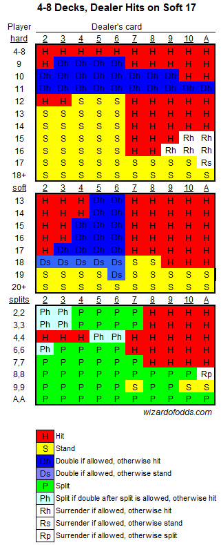
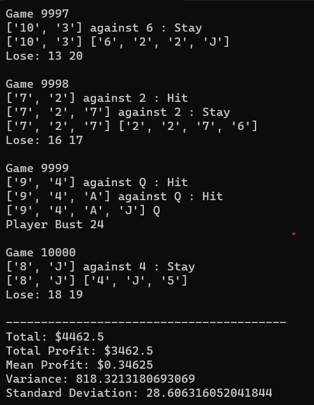

# Blackjack Simulator

Inspired from my time at Marina Bay Sands' Casino. This script is a Python-based blackjack simulator that allows you to simulate multiple blackjack games with a strategy from [WizardofOdds](https://wizardofodds.com/games/blackjack/strategy/calculator/) and track your profit. The simulator uses a continuous shuffler, which means that the deck is reshuffled after each hand.

## How to Use

To use the simulator, follow these steps:

Open a terminal or command prompt in the repository folder and run the `blackjack_simulator.py` script. You can use the following command-line arguments:

- `--num-games`: The number of games to simulate (default: 10000).
- `--starting-capital`: The starting capital in dollars (default: 1000).
- `--bet-amount`: The bet amount in dollars (default: 25).

## Example Usage:
python blackjack_simulator.py --num-games 5000 --starting-capital 2000 --bet-amount 50

After the simulation is complete, the script will display the total profit, mean profit, variance, and standard deviation for the simulated games.

## Disclaimer
Please note that this simulator is for educational and entertainment purposes only. It does not guarantee any real-life gambling results. Always gamble responsibly.